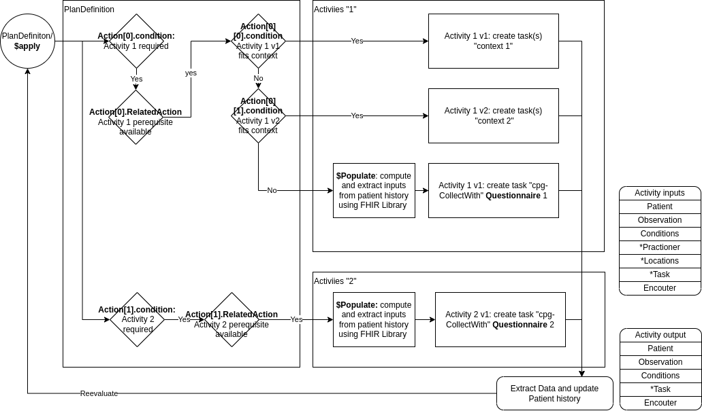
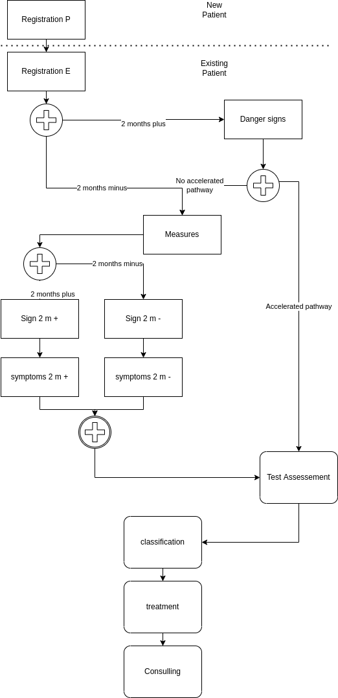
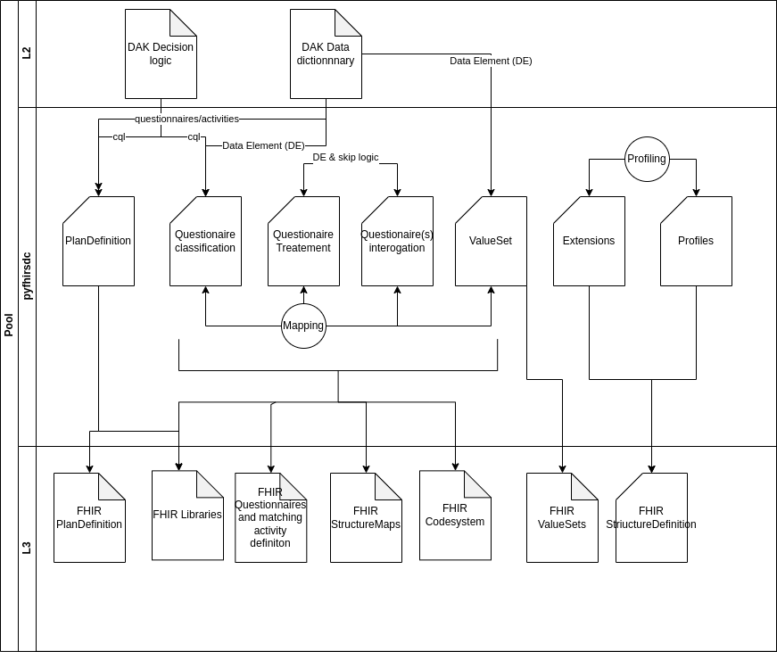

This implementation guide provides computable content based on the Digital Adaptation Kit (DAK) to facilitate the implementation of the Clinical Care in Crises guidelines. The following diagram illustrates the components of a Digital Adaptation Kit and how those components are represented in FHIR:

* [**General Approach**](#general-approach) General Approach describe how the differentes activities are articulated in the DAK

### General Approach

The general approach is to use the PlanDefiniton to start the relevant task/questionnaire based on the Patient and its history

/!\ this part with PlanDefinition is not yet in place because we didn't succeded to generate CarePlan from PlanDefiniton with cpg-collectWith activityDefinition

The PlanDefinition will compute the task (implementation of an activity) required for a given patient when a EmCare encounter starts, it get updated at the end of each tasks

the picture above shows the posssiblity to replace the data collection proposed in that IG (FHIR questionnaire) by any other tasks given the task will create the required outputs expected later in the Encounter

Most, if not 100%, of the logic depicted in the image above is located in CQL libraries, those library could be reused by other task than the "cpg-collectWith" ones, for example the classification library could be reused to have the cases definiton of EMcare classification

The questionnaire are for data collection but the question display logic plays a role in the consultation because a based on answer outpout may or may not be collected which would impact the decision logic later on.

### Encounter Activities

Each activity within an Encounter follows those steps:
- Identifiy the patient (managed by the L4)
- Retrieve relevant patient information (Observations and Conditions) collected during the encounter or in the past (FHIR CQL library are used)
- if Required, Collect additionnal information relevant with regard to the already collected information (both within and outside the activity); the default data-collection takes the form of a FHIR Questionnaire
- Export result into the FHIR data store (mainly Observation and Condition)

Each activity may require those artefacts:
- ActivityDefinition
- Questionnaire
- Library
- StructureMap
- *Task

#### Sequence Diagrams

Diagram picturing the relation between activities for this IG

### Activities

The key activities for Clinical Care in Crises (EmCare) are the following

|Code|Description|Applicability | predecessor |
|---|---|---|---|
|[EmCareA.Registration.P](ActivityDefinition-emcarea.registration.p.html) | New Patient registration  [NEED_INPUT] | Any | New Patient |
|[EmCareA.Registration.E ](ActivityDefinition-emcarea.registration.e.html)| New Encounter registration  [NEED_INPUT] | Any | New Encounter |
|[EmCare.B7.LTI-DangerSigns ](ActivityDefinition-emcare.b7.lti.dangersigns.html )|Danger signs [NEED_INPUT] | >= 2 months | Registration |
|[EmCare.B6.Measurements](ActivityDefinition-emcare.b6.measurements.html )| Measurement [NEED_INPUT] | Any | Danger Signs |
|[EmCare.B18-21.Symptoms.2m.m](ActivityDefinition-emcare.b18-21.symptoms.2m.m.html)| Signs infant [NEED_INPUT]|_futurework_| Measurements |
|[EmCare.B10-14.Symptoms.2m.p](ActivityDefinition-emcare.b10-14.symptoms.2m.p.html)|Signs Child [NEED_INPUT] | >= 2 months|Measurements|
|[EmCare.B18-21.Signs.2m.m](ActivityDefinition-emcare.b18-21.signs.2m.m.html)|Symptoms infant [NEED_INPUT]|< 2 months|Symptoms|
|[EmCare.B10-16.Signs.2m.p](ActivityDefinition-emcare.b10-16.signs.2m.p.html)|Symptoms child [NEED_INPUT]|>= 2 months| Symptoms|
|[EmCare.B22.AssessmentsTests](ActivityDefinition-emcare.b22.assessmentstests.html)| Assessemnt-Test [NEED_INPUT]| See details below | Any |
|[EmCare.B23.Classification.2m.m](ActivityDefinition-emcare.b23.classification.m.html)|Classification infant [NEED_INPUT]|< 2 months|Assessement-test|
|[EmCare.B23.Classification.2m.p](ActivityDefinition-emcare.b23.classification.html)|Classification Child[NEED_INPUT]|>= 2 months|>= 2 months|
|[EmCare.Treatment](ActivityDefinition-emcare.treatment.html)|Treatment [NEED_INPUT]|Any|Any|

##### Assessement and test sub-activities

|Code|Description|Applicability|
|---|---|---|
|[Breastfeeding](ActivityDefinition-emcare.b22.breastfeeding.html)|[NEED_INPUT]|AgeInMonths >=2 and AgeInMonths  <6 and "severe classification up to assessments and tests excluding severe dehydration" !=true OR AgeInMonths <2 and  "Breastfed" = true and "yi severe classification other than severe dehydration" !=true |
|[Respiratory Rate](ActivityDefinition-emcare.b22.respiratoryrate.html)|[NEED_INPUT]|("Cough" = true or "Difficulty Breathing" = true or "AgeInMonths"<2) and "Fast Breathing" is null |
|[Bronchodilator](ActivityDefinition-emcare.b22.bronchodilatortest.html)|[NEED_INPUT]|("Cough" = true or "Difficulty Breathing" = true) and "Wheezing" = true and ("Fast Breathing" = true or "Chest Indrawing" = true) and  "danger signs" != true and "Stridor in a calm child"= false and "Oxygen Saturation" >= 90 '%'|
|[Hemoglobin](ActivityDefinition-emcare.b22.hemoglobin.html)|[NEED_INPUT]|"Palmar pallor" = "Some palmar pallor" or "Palmar Pallor" = "Severe Palmar Pallor" or "Mucous membrane pallor" = "Some mucous membrane pallor" or "Mucous membrane pallor" = "Severe mucous membrane pallor"|
|[Second Temperature](ActivityDefinition-emcare.b22.secondtemperature.html)|[NEED_INPUT]|"psbi other than temperature" != true and AgeInMonths()<2 and "Axillary Temperature  (degrees Celcius)" > 38.5 'Cel'| 
|[FluidTest](ActivityDefinition-emcare.b22.fluidtest.html)|[NEED_INPUT]|("Not able to drink or breastfeed" = true or "Vomiting Everything" = true or "Diarrhoea" = true) and "Oral Fluid Test Results" is null|

### Data Elements

Data elements are represented within this implementation guide using a codesystem  of the appropriate resource as well as libraries of associated calculation logic for calculated, or inferred, data elements.

Note that some "Data elements" from the perspective of the Data Dictionary presented in the DAK are actually rollups. For example, Patient last name is a specific data element within the DAK, but is represented as one of many elements in the EmCare Patient profile.

#### Data Element Processing

The following diagram illustrates the processing used to derive FHIR terminology and profile resources from the data dictionary using [pyfhirsdc](https://github.com/SwissTPH/pyfhirsdc)

The inputs on the left consist of:

1. Data elements in the data dictionary, defining a unique _label_ for each, along with other metadata such as definition, data type, and input options.
2. FHIR mappings for each element, establishing a path to a FHIR resource type and element, as well as a base profile and establishing contexts for the element, Alias of Mapping snippet could be used for better readability

NOTE: The FHIR mappings are not part of the Digital Adaptation Kit, but are introduced as part of this implementation guide. The xls_form_iraq_v1.xlsx spreadsheet in the `input/l2` folder is the source for these mappings, and was created by copying the WHO L2 spreadsheet from the Digital Adaptation Kit following the pyfhirsdc format, and then adding the FHIR mapping columns and providing the individual data element mappings.

The outputs on the right consist of:

1. **CodeSystem:** An EmCare-specific code system that contains concepts for each element and input option in the data dictionary
2. **ConceptMap:** Mappings from each code in the EmCare-specific code system to the various standard terminologies (still to be developped)
3. **ValueSet:** Valuesets for each data element concept and the possible values for that concept
4. **Profile:** StructureDefinition resources for the profiles (and any necessary extensions) to represent the data elements as FHIR resources
5. **Questionnaire:** Questionnaire resources, one for each activity, with questions for each data element used by the activity
6. **Concepts (cql):** A Concepts CQL library with declarations for each value set (each data element concept and the possible values for it)
7. **DataElements (cql):** A DataElements CQL library from both the Patient and Encounter perspectives, keyed by the _label_ of each data element.

Separating the Concepts CQL allows the domain-friendly name for each concept and answer set to be referenced by that name within the logic. This pattern also allows implementations to easily vary implementation by providing alternate versions of the Concepts library with their own definitions for the value sets, supporting local adaptation.

Separating the Patient and Encounter perspectives of the DataElements libraries allows the same data elements to be used from different contexts, depending on the use case. For example, when referenced from decision support logic, the Encounter perspective is typically used, whereas from indicator logic, the Patient perspective is typically used.

#### Data Model

The model for data elements represented within this implementation guide is based on the following profiles. All the data elements defined derive from one of these profiles, and all data used within smart content and related decision support rules and health metrics use these profiles, or profiles that are derived from them:

|Profile|
|---|
|[EmCare Condition](StructureDefinition-emcare-condition.html)|
|[EmCare Observation](StructureDefinition-emcare-observation.html)|
|[EmCare Patient](StructureDefinition-emcare-patient.html)|

#### Data Elements by Activity

The following index lists all data elements, grouped by their activity:



<!--
#### Data elements by profile

TODO
-->

### Decision-support Logic

Decision tables within this implementation guide are represented with a combination of recommendation definitions and libraries of associated criteria logic.

#### Decision-table Processing

The following diagram illustrates the processing used to derive decision support rules and logic from the decision tables:

The input on the left consists of decision tables included in the Digital Adaptation Kit.

The output on the right consists of:

1. PlanDefinition resources conforming to the CPGRecommendationDefinition profile, one for each decision table. Each PlanDefinition contains:
    1. An action for each unique action in the decision table
    2. A definition for the criteria associated with the action
2. CQL Library files that reference the Concepts and DataElements CQL libraries produced by the data dictionary processing. Each file contains an empty definition for each condition of each action, named with the description of the action, and a comment with the combined pseudo code for the conditions for that action.

Because the pseudo-code for the criteria in the decision table is expressed in terms of the labels for the data elements, a knowledge-engineer can easily take the pseudo-code, and by referencing the expressions from the DataElements libraries, construct the CQL for the condition logic.

#### Plan Definition Index



### Functional requirements

Functional requirements are specified in the Digital Adaptation Kit. Future work may involve specifying these requirements as CapabilityStatement resources, depending on feedback from the implementation community.
